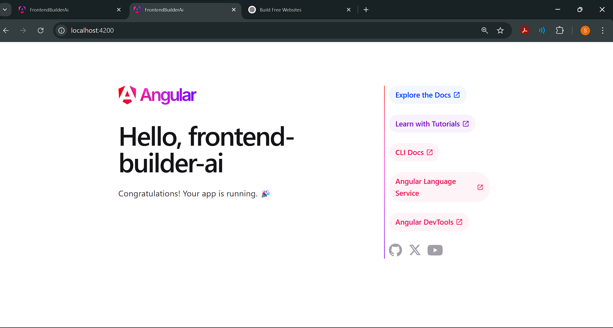

# 🚀 Frontend Builder AI

> ✨ **Build frontend interfaces effortlessly with AI-powered automation!**


---

## 📌 Features

✅ **Drag & Drop Components** 🎨  
✅ **Live Code Preview** 🖥️  
✅ **Generate Angular UI Code** ⚡  
✅ **Firebase Authentication & Database** 🔥  
✅ **State Management with NgRx** 🛠️  
✅ **Responsive Design with Tailwind CSS** 🎭  
✅ **Export Clean & Optimized Code** 📜  
✅ **Save & Load Designs** 💾  

---

## 🛠 Tech Stack

🔹 **Frontend:** Angular, Tailwind CSS  
🔹 **State Management:** NgRx  
🔹 **Backend:** Firebase (Authentication, Firestore)  
🔹 **UI Components:** Angular Material  
🔹 **AI Integration:** OpenAI API (for smart recommendations)  

---

## 📦 Packages Used

📌 **Core Dependencies:**  
- `@angular/core` – Angular framework
- `@angular/material` – Pre-built UI components
- `@ngrx/store` – State management
- `firebase` – Firebase SDK for authentication & database
- `@angular/fire` – Angular Firebase integration
- `tailwindcss` – Utility-first CSS framework
- `openai` – AI-powered code suggestions

📌 **Development Dependencies:**  
- `@angular/cli` – Angular CLI for project management
- `typescript` – TypeScript for static typing
- `eslint` – Linting and code quality
- `prettier` – Code formatting

---

## 📂 Project Structure

```
frontend-builder-ai/
│── src/
│   ├── app/
│   │   ├── components/
│   │   │   ├── ui-builder/
│   │   │   │   ├── ui-builder.component.ts
│   │   │   │   ├── ui-builder.component.html
│   │   │   │   ├── ui-builder.component.css
│   │   │   │   ├── ui-builder.component.spec.ts
│   │   ├── services/
│   │   ├── app.component.ts
│   │   ├── app.module.ts (If applicable)
│── environments/
│── angular.json
│── package.json
│── README.md
```

---

## 🚀 Installation & Setup

### 1️⃣ Clone the Repository
```sh
git clone https://github.com/yourusername/frontend-builder-ai.git
cd frontend-builder-ai
```

### 2️⃣ Install Dependencies
```sh
npm install
```

### 3️⃣ Configure Firebase 🔥
- Create a **Firebase Project** from [Firebase Console](https://console.firebase.google.com/)
- Copy the Firebase config & paste it into `src/environments/environment.ts`

### 4️⃣ Run the Project
```sh
ng serve
```
> Open **http://localhost:4200** in your browser 🌐

---

## 🎨 Screenshots



---

## 🎯 How to Use

1️⃣ **Add Components**: Drag & drop UI elements into the workspace. 🎨  
2️⃣ **Customize Components**: Adjust properties like color, text, and layout. 🛠️  
3️⃣ **Preview UI**: Instantly see how your UI looks in real-time. 👀  
4️⃣ **Generate Code**: Click "Export" to get Angular code for your design. ⚡  
5️⃣ **Save & Load**: Save your UI designs and reload them anytime. 💾  
6️⃣ **AI Suggestions**: Get smart recommendations for UI improvements. 🤖  

---

## 🏆 Problem Solving

Frontend Builder AI helps developers by:
- 🚀 **Speeding up UI development** with drag-and-drop functionality.
- 🔥 **Reducing code errors** using AI-powered recommendations.
- 🎨 **Ensuring design consistency** with reusable components.
- 💡 **Allowing real-time collaboration** through Firebase integration.
- ⚡ **Optimizing frontend performance** with clean, generated code.

---

## 🤝 Contributing

We welcome contributions! 🎉 Feel free to fork the repo & submit pull requests. 

1. Fork this repo 🍴
2. Create a feature branch 🌿
3. Commit your changes 💡
4. Push & create a PR 🚀

---

## 📜 License

🔓 Open-source under [MIT License](LICENSE).

---

## 📞 Contact & Support

📧 **Email:** rathodsachin0766@gmail.com

